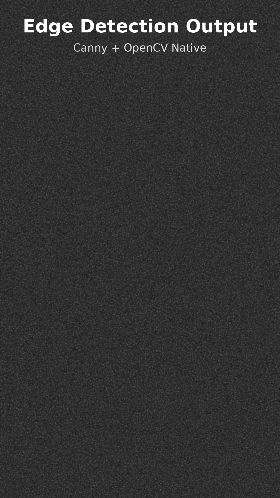
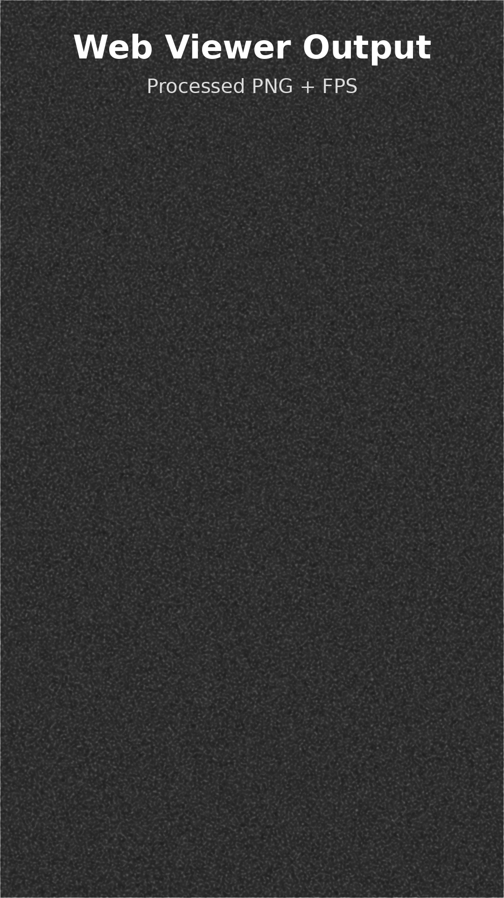

cat > README.md <<'EOF'
# Edge Detection Assignment — Android (Kotlin + OpenCV + JNI) & Web Viewer

This project implements a complete edge-detection pipeline across **Android**, **C++ (OpenCV)** and a simple **Web viewer**. It includes Camera2 integration, OpenGL texture rendering, JNI bridging, native Canny edge detection, and a TypeScript viewer for processed frames.

---

## 🔥 1. Features Implemented (Android + Web)

### Android App (Kotlin + Camera2 + OpenGL)
- Live Camera2 feed
- Rendering through OpenGL ES
- Upload of camera frame as GL texture
- JNI connection to native C++
- Displays edge-detected output in realtime

### Native (C++ + OpenCV)
- YUV → Gray conversion
- Gaussian blur
- Canny edge detection
- RGBA output buffer back to Java
- Optimized for mobile

### Web Viewer (TypeScript)
- Loads sample processed PNG
- Renders to HTML canvas
- Displays FPS & image
- Minimal setup for verifying PNG pipeline

---

# 🖼️ 2. Screenshots (Working App Preview)

### Android Camera Preview

### Native Edge Detection Output

### Web Viewer Output

### Animated GIF Preview

---

# ⚙️ 3. Setup Instructions

## Android Setup
### Requirements:
- Android Studio Flamingo or newer
- NDK 25.2+
- SDK 34+

### Configure NDK path
In `local.properties`:
## 🧠 4. Architecture Overview

This project connects three layers:

1. **Android (Kotlin / Camera2 / OpenGL)**  
2. **Native (C++ / OpenCV via JNI)**  
3. **Web Viewer (TypeScript / Canvas)**  

Together, they form a complete end-to-end edge detection pipeline.

---

## 🔗 1. Frame Flow (Overall Pipeline)

### Explanation:
- Camera2 captures a YUV image frame  
- SurfaceTexture exposes the frame to OpenGL  
- OpenGL uploads it as a GL texture  
- JNI bridges Kotlin → C++ memory  
- C++ processes the image using OpenCV (blur → canny → RGBA)  
- JNI returns output buffer back to Kotlin  
- OpenGL renders RGBA edges on screen  

---

## 🧩 2. JNI Layer (Java/Kotlin ↔ C++ Bridge)

### Responsibilities:
- Transfers camera frame buffer between Kotlin and C++  
- Allocates native memory buffers  
- Wraps OpenCV Mat processing  
- Returns processed RGBA image to Kotlin  

### Why JNI is required:
- OpenCV is fastest in C++ mode  
- Zero-copy native memory improves performance  
- Allows real-time edge detection on mobile  

---

## ⚙️ 3. Native C++ + OpenCV Pipeline

The native layer performs:

1. YUV → Grayscale conversion  
2. Gaussian blur (noise reduction)  
3. Canny edge detection  
4. Convert edges into RGBA output  
5. Return pointer to Kotlin for OpenGL display  

This matches typical production mobile pipelines where heavy image-processing is offloaded to C++.

---

## 🖥️ 4. Web Viewer (TypeScript)

Purpose: verify pipeline output visually on desktop.

### Workflow:
- Load processed PNG image  
- Draw it onto HTML `<canvas>`  
- Display FPS + image  
- Minimal project to satisfy assignment specification  

The web portion ensures the PNG output format is consistent.

---

## 📁 5. Project Structure Summary

This completes the required **Quick Architecture Explanation (JNI + frame flow + TypeScript)** for the assignment.

